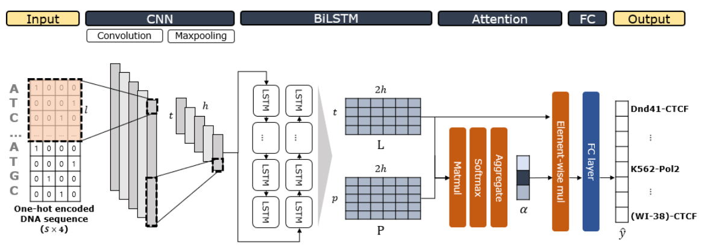

# Keras implementation of CLARINET.
CLARINET is an attention based neural network that predicts transcription factor-DNA binding from a given DNA sequence.

  Overview of CLARINET

## Requirements
- numpy (1.14.6)
- h5py (2.8.0)
- scipy (1.1.0)
- sklearn (0.20.1)
- theano (1.0.3)
- keras (2.2.4, backend:theano)

## Usage
### Data
The ChIP-seq data used in this work can be downloaded from <http://deepsea.princeton.edu/media/code/deepsea_train_bundle.v0.9.tar.gz>.

### Train CLARINET
`CLARINET.ipynb`

### Evaluation
`CLARINET-test.ipynb`
